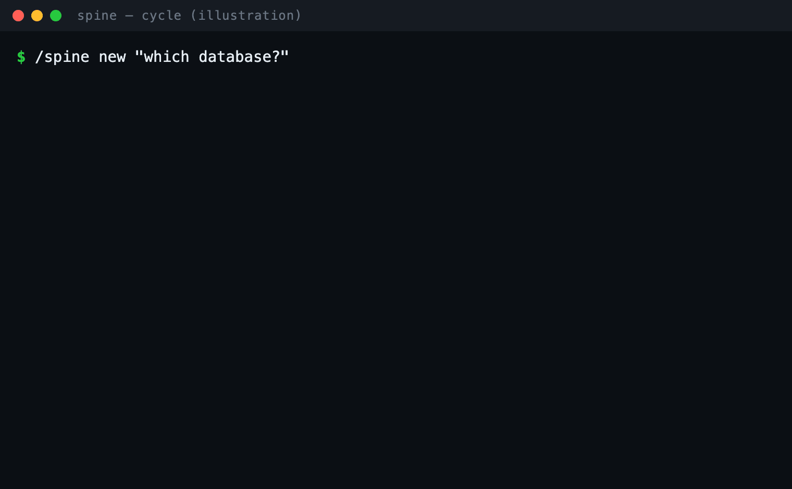

# spine — planning that stays a file, not lost in the chat

[](https://github.com/czl-rsa/spine/actions/workflows/gate.yml)
[](LICENSE)

A Claude Code CLI skill for **crystallize-then-advance planning**. Brainstorm freely in a
disposable chat; when a thought settles, `/spine` rewrites it as one compact, gated block in a
git-tracked file — so your decisions survive `/clear` and don't drown in scrollback.



<sub>Illustration of the loop (not a live screen recording).</sub>

> The chat is scratch (burn it with `/clear`). The file `drafts/spine/<topic>.spine.md` is the
> clean copy: settled decisions land one at a time, append-only, never rewritten behind your back.

## Install
```bash
git clone https://github.com/czl-rsa/spine ~/.claude/skills/spine
```
Then run `/spine help` in Claude Code. Repo-agnostic — works in any project, and skips git steps outside a repo.
(For a single project only, clone into `<project>/.claude/skills/spine` instead.)

## Why
In the CLI you can't edit a past message, so the editable thing is moved into a file and the chat is
treated as throwaway. You come back tomorrow and see exactly what you concluded — not 400 turns of noise.

## Commands
| | |
|---|---|
| `/spine new "question"` | open a new topic — the plan gets its own file |
| `/spine` | write the settled decision to the file; on a fresh chat, re-inject the essence to resume |
| `/spine drop` | wipe the current unfinished draft node (never touches frozen decisions) |
| `/spine help` | the cheat-sheet |

## The gate (what stops an empty "yes")
A node is only crystallized if it carries real substance. Its **type** lives in the header tag
`[GOLDEN·<type>]` and each type is checked differently — a bare "yes" fails every one:

| type | needs |
|---|---|
| `factual` (default) | `How it works:` line with a real cite (`file.ext:line` or `§section`) |
| `decision` | `Why:` (a real reason) + `Rejected:` (the alternative you turned down) |
| `definition` | `Was:` (the old meaning) + `Why-not:` (why it's wrong) |
| `open` | `Blocks:` (what's blocked) + `Resolve:` (what would close it) |

The gate (`scripts/spine-gate.sh`) is a deterministic shell script — no model in the commit path.
It is a **floor, not a ceiling**: a shape-valid cite can still point at the wrong place; that's the
author's judgement.

## The loop
`think (chat) → /spine (write essence + "now reset") → /clear → /spine (re-inject essence) → think again, light.`

## Test
```bash
cd tests && for f in node-*.md; do bash ../scripts/spine-gate.sh "$f"; done
```
14 fixtures cover every type + the adversarial cases (bare "yes", repetition, punctuation-dressed
approvals, unknown type, multi-node blocks).

## Note
Output is English. The mechanism is language-agnostic — the gate keys off structural tokens
(`[GOLDEN·<type>]`, `**Crystal:**`, `**Why:**`, …), so localizing the prompts is a small change in `SKILL.md`.

## License
[PolyForm Noncommercial License 1.0.0](https://polyformproject.org/licenses/noncommercial/1.0.0) — see [`LICENSE`](LICENSE).

Free for any **noncommercial** use (personal, research, education, hobby projects, nonprofits).
**Commercial use requires a separate license from the author** — open an issue to arrange one.
This is **source-available**, not OSI open-source (the no-commercial-use restriction is a field-of-use limit).
